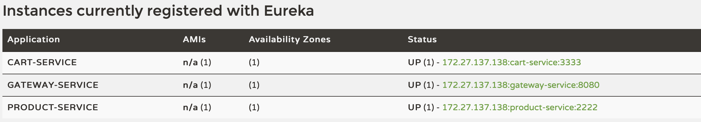
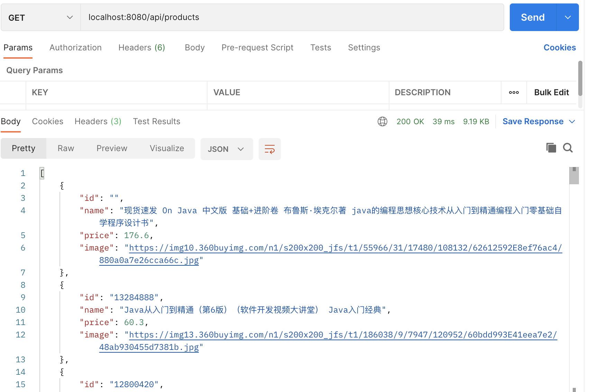
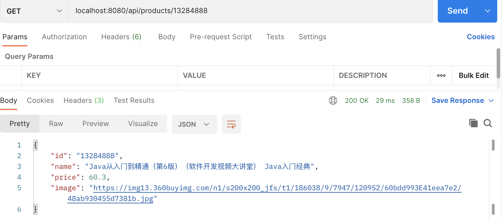
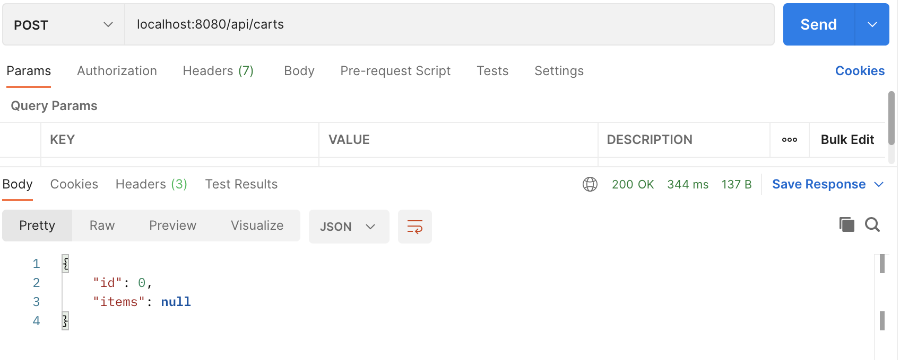
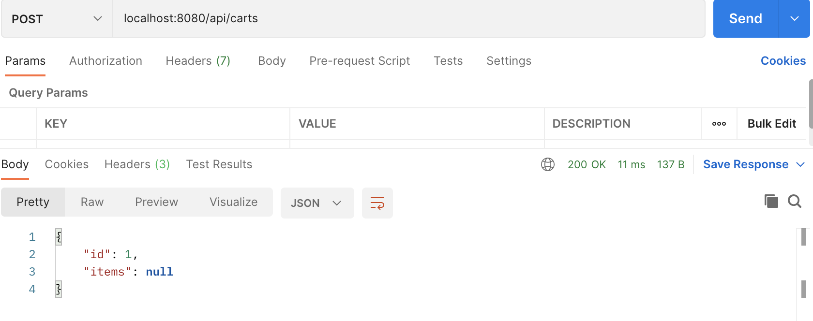
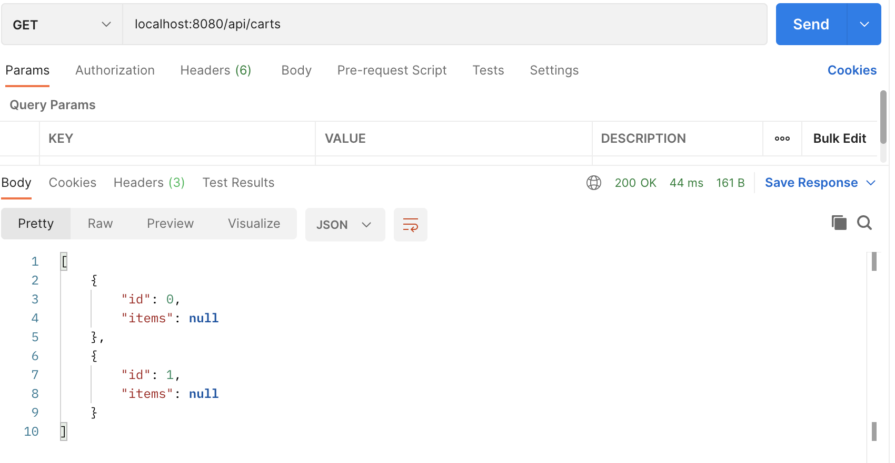
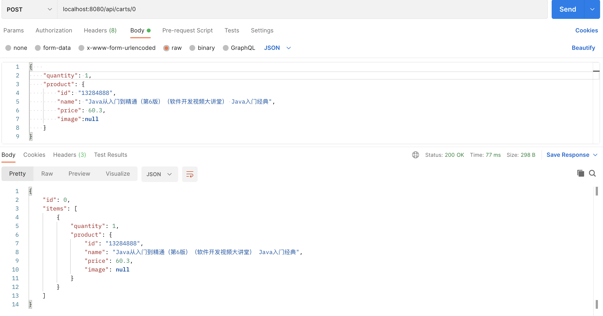
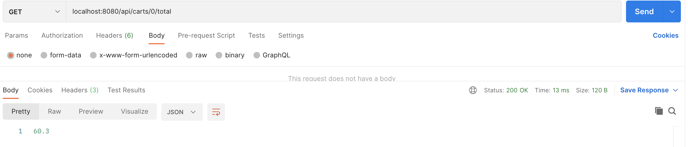

### 微服务架构
将eureka的注册服务放在1111端口，gateway放在8080端口，pos-product服务放在2222端口，pos-cart服务放在3333端口。gateway负责接受用户的服务请求并将相应的请求转发至2222或3333端口上。

### 服务功能
查看全部商品信息

查看特定商品信息

添加购物车

查看购物车信息

给某一购物车加入商品

查看某一购物车的总价
